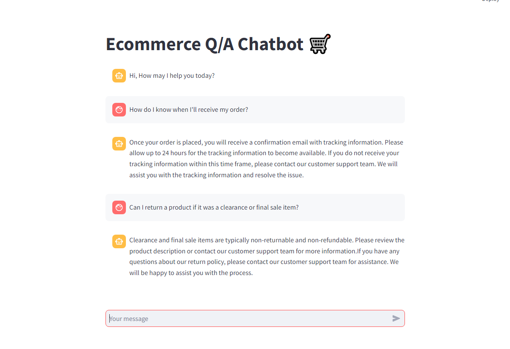

# Ecommerce Q-A fine tune using qlora
In this project, we focused on enhancing an e-commerce Q&A system by fine-tuning the Falcon 7B language model using QLoRA (Quantized Low-Rank Adaptation). The aim was to improve the model's ability to handle and accurately respond to user queries related to e-commerce products and services.


## Getting Started
1. Clone the repository:
   ```
   git clone https://github.com/bunty187/Ecommerce-Q-A-fine-tune-using-qlora.git
   cd Ecommerce-Q-A-fine-tune-using-qlora
   ```
2. Install the libraries:
   ```
   pip install -r requirements.txt
   ```
3. Set Environment Variables:
   ```
   export HUGGING_FACE_ACCESS_TOKEN='your_hugging_face_access_token
   ```
4. Launch Streamlit App:
   ```
   streamlit run app.py
   ```
5. Use the Chatbot:
   * Open your web browser and go to http://localhost:8501 (default Streamlit port).
   * You will see the chat interface titled "🛒E-Commerce Q/A Chatbot".
